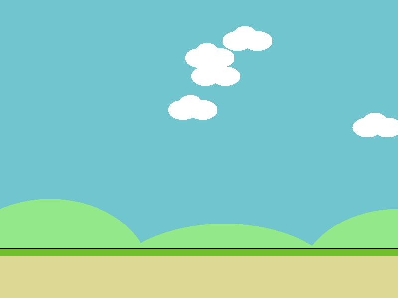

# FlippingBird

A high-quality Flappy Bird clone built with Java Swing and Java2D.

## Features

- **Animated Bird**: Smooth physics-based movement with rotation.
- **Endless Gameplay**: Procedural pipe generation with random heights.
- **Assets Recovery**: Dynamically generates PNG and WAV assets if missing.
- **Scoring System**: High score persistence.
- **States**: Start, Playing, Paused, and Game Over screens.
- **Retro Sound Effects**: Synthesized jump, score, and hit sounds.

## Controls

- **SPACE**: Jump / Start Game
- **P**: Pause / Resume
- **R**: Restart (on Game Over)
- **ESC**: Exit

## Project Structure

- `src/main/java/com/flippingbird/`
  - `Main.java`: Entry point.
  - `Game.java`: Window management and persistence.
  - `GamePanel.java`: Game loop, rendering, and logic.
  - `Bird.java`: Player physics and animation.
  - `Pipe.java`: Obstacle logic.
  - `Assets.java`: Resource management.
  - `Sound.java`: Audio playback.
  - `Utils.java`: Procedural asset generation.
- `assets/`: Folder containing generated/provided images and sounds.

## How to Run

1. Open the project in VS Code or IntelliJ IDEA.
2. Run the `Main` class.
3. If the `assets/` folder is empty, the game will automatically generate the necessary files on the first run.

## Screenshots

*(Placeholder for screenshots)*

